# NgeMood - Frontend Client 🎨

Aplikasi web modern (Client-Side) yang dibangun menggunakan **Next.js
16**.\
NgeMood menyediakan antarmuka yang **responsif, estetis, dan
interaktif** untuk membantu pengguna memantau dan mengekspresikan mood
harian mereka dengan dukungan AI.

------------------------------------------------------------------------

## 📑 Table of Contents

-   [Galeri Aplikasi](#-galeri-aplikasi)
-   [Instalasi](#️-instalasi)
-   [Development](#-development)
-   [Struktur Halaman](#-struktur-halaman)

------------------------------------------------------------------------

## 📸 Galeri Aplikasi

### 🔐 Autentikasi

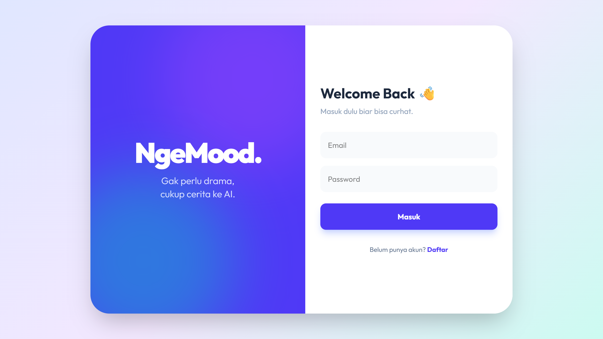\
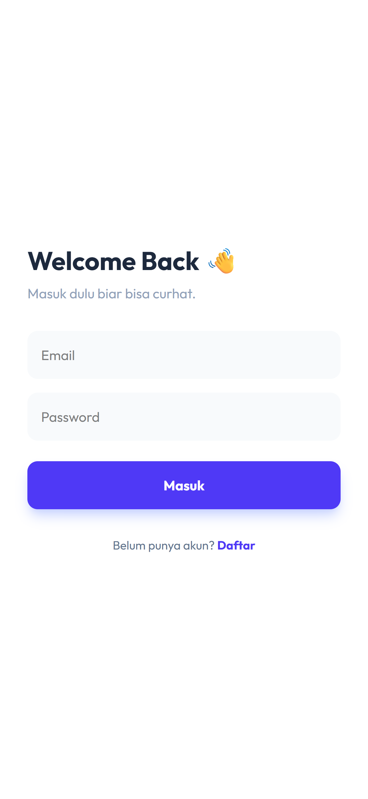

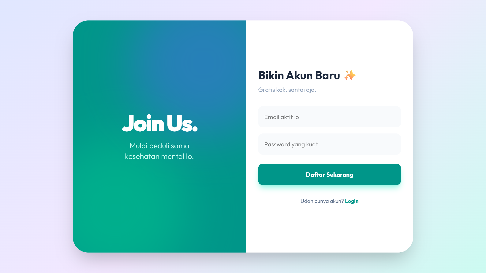\
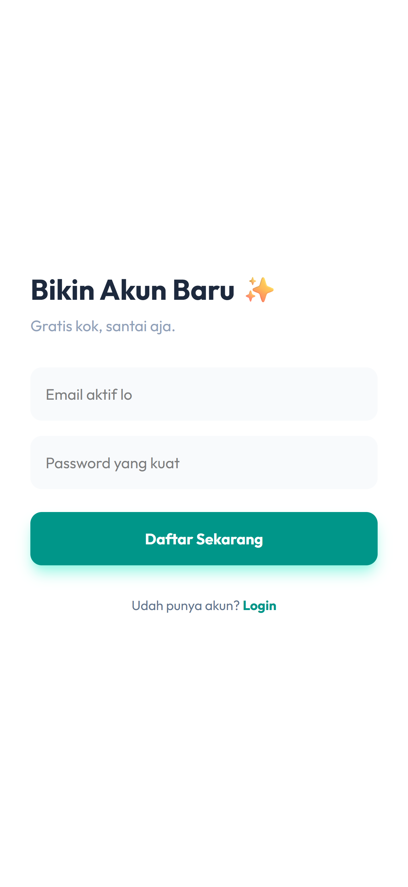

------------------------------------------------------------------------

### 🏠 Dashboard Utama

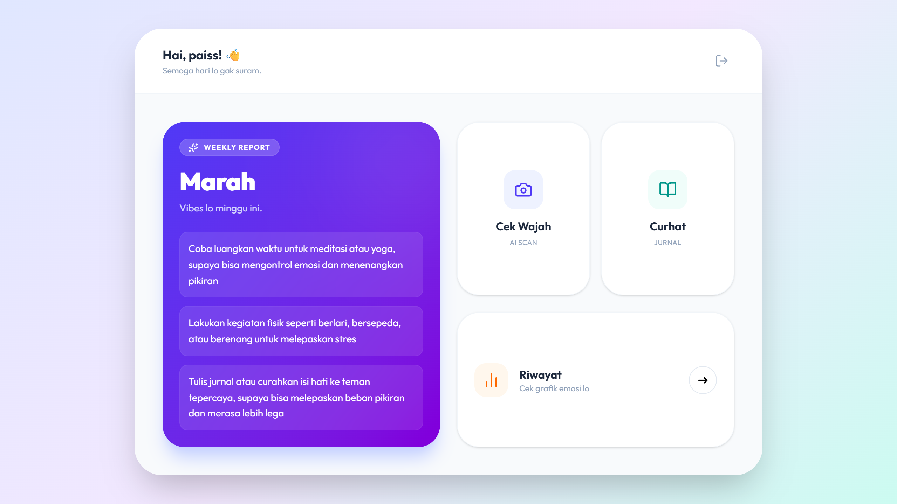\
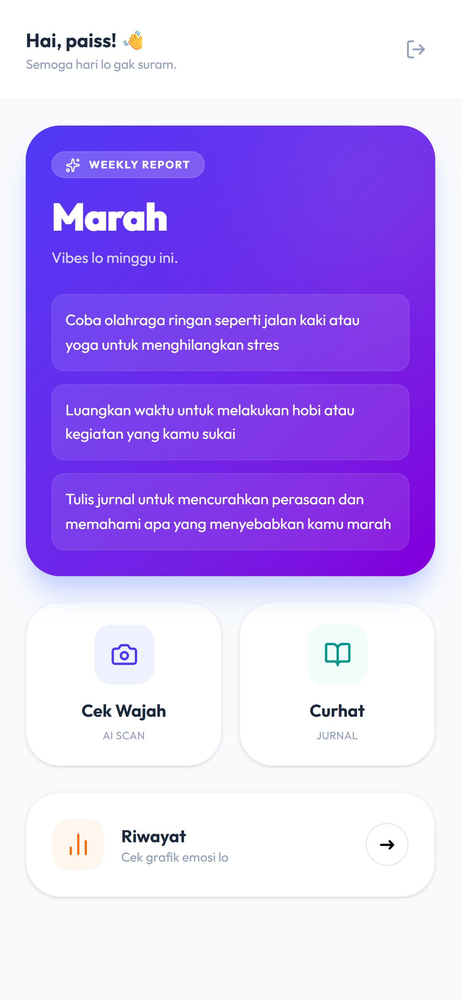

------------------------------------------------------------------------

### 🤖 Fitur AI

\


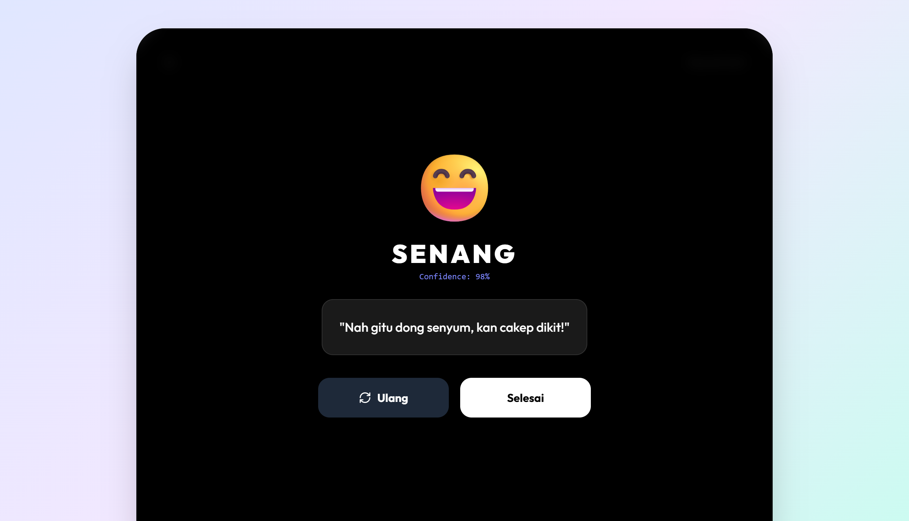\
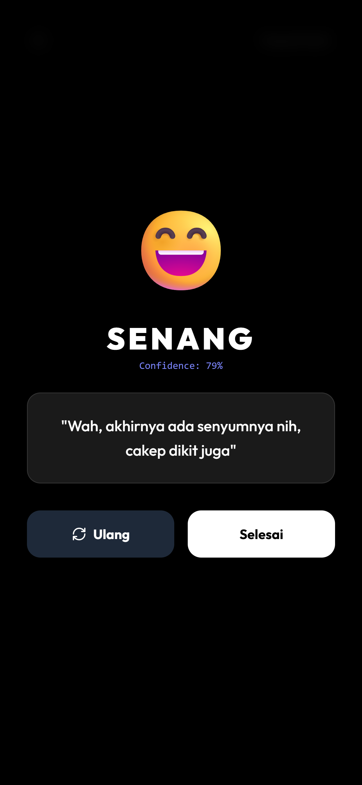

------------------------------------------------------------------------

### 📔 Jurnal & Riwayat

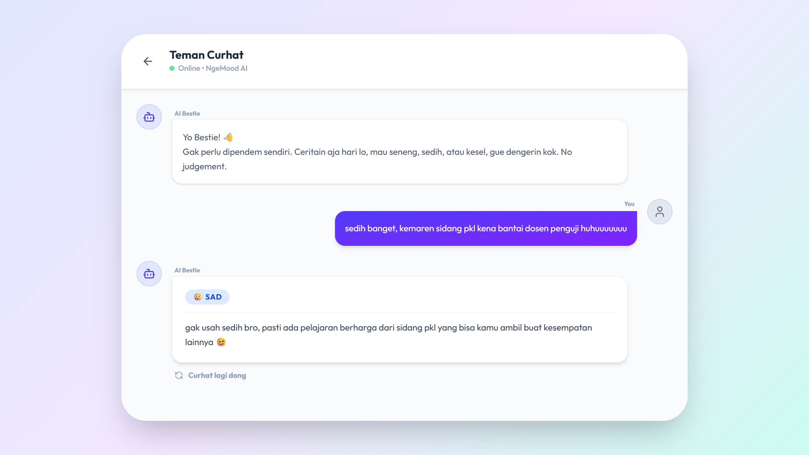\
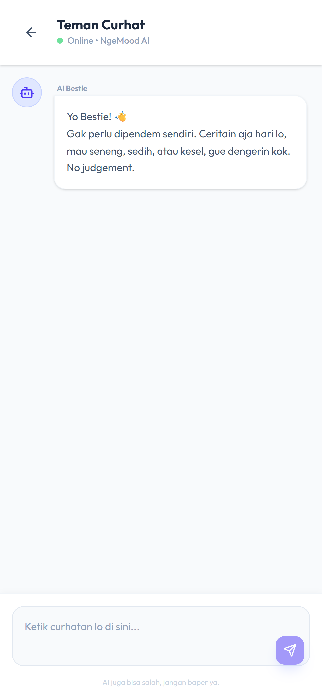

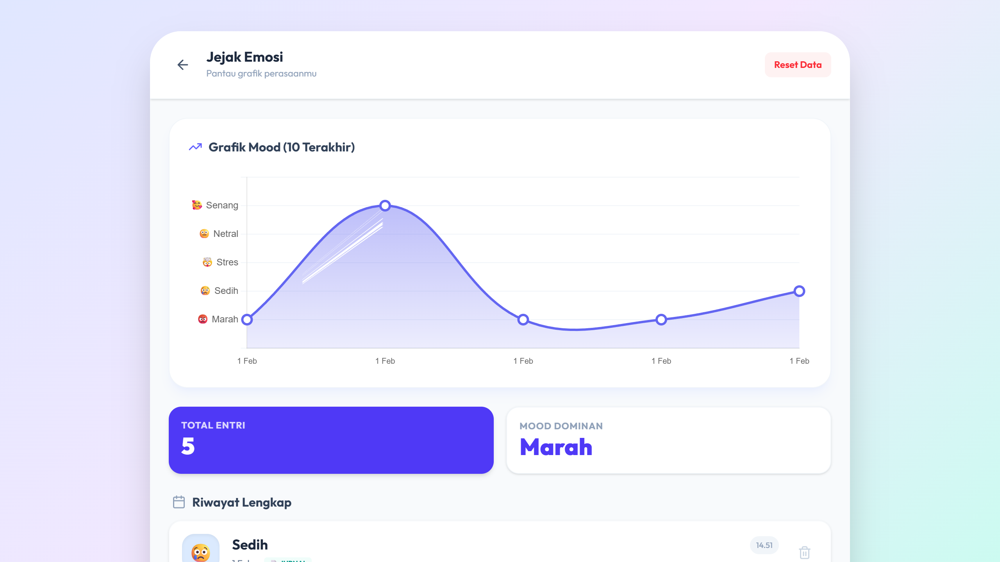\
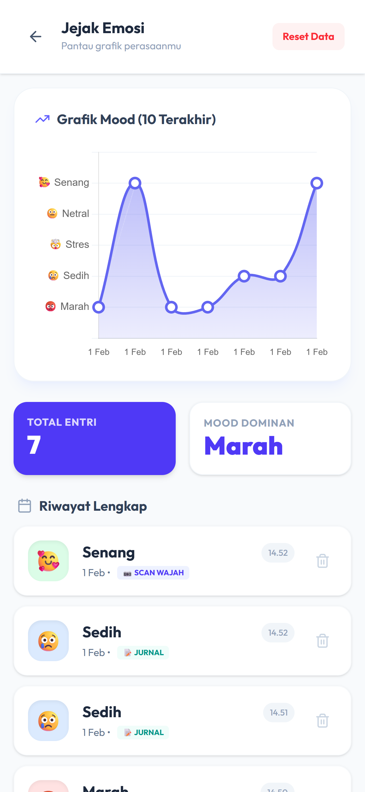

------------------------------------------------------------------------

## 🛠️ Instalasi

``` bash
cd frontend
npm install
```

Buat `.env.local`:

``` env
NEXT_PUBLIC_API_URL=http://localhost:8000
```

------------------------------------------------------------------------

## 🚀 Development

``` bash
npm run dev
```

Akses: http://localhost:3000

------------------------------------------------------------------------

## 📂 Struktur Halaman (`app/`)

-   `/login`, `/register`
-   `/dashboard`
-   `/face-checkin`
-   `/journal`
-   `/history`

------------------------------------------------------------------------

✨ NgeMood Frontend Client
